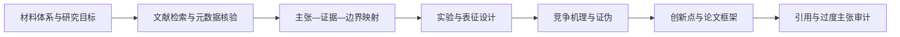

<div align="center">


# Materials Research Guide

**Evidence-grounded research planning for any materials system.**

基于可核验文献，为任意材料体系生成实验方案、表征矩阵、竞争机理、创新点评估与论文框架。


</div>

> **Internal Skill name:** `evidence-grounded-materials-research`  
> **Display/repository name:** `materials-research-guide`

## Why this Skill?

通用 AI 很容易生成“看起来合理”的实验条件、机理和引用，但材料研究需要的是可追溯、可验证、可证伪的设计。

Materials Research Guide 强制 Agent 遵循“证据先于方案”：

- 先检索并核验文献，再提出实验路线；
- 将每条关键主张连接到真实 DOI、PMID、arXiv ID 或稳定来源；
- 区分直接证据、邻近体系外推、工程起始值和未知项；
- 同时提出主机理与竞争机理，并设计证伪实验；
- 无法核验时停止输出确定性结论，不伪造引用、参数、数据或创新性。

## What It Produces

| 模块 | 输出 |
|---|---|
| 文献证据 | 检索策略、证据表、来源等级、核验深度与证据缺口 |
| 实验设计 | 样品组、变量、对照、重复、统计方法、成功标准与停止条件 |
| 表征策略 | 科学问题—方法—可观察量—假设—局限—互证矩阵 |
| 机理分析 | 主假设、竞争假设、因果链、替代解释与证伪实验 |
| 创新点评估 | 最接近工作、实际差异、价值、可行性与夸大风险 |
| 论文框架 | 中心论点、章节逻辑、结果顺序、主图规划与适用边界 |

适用于催化、能源材料、摩擦学、腐蚀、涂层、金属、陶瓷、聚合物、复合材料、界面工程和其他材料体系。

## Evidence-First Workflow



文献核验深度分为：

- `M` — Metadata：只核验书目信息与标识符；
- `A` — Abstract：摘要可直接支持有限主张；
- `F` — Full text：正文、方法或补充材料支持具体条件与结果。

`M` 级来源不能用于支持具体实验参数；来自相邻体系的参数必须显式标注外推风险。

## Quick Start

### 1. Install from SkillHub

Skill 通过平台审核后，可安装到 Codex：

```bash
skillhub install evidence-grounded-materials-research --dir ~/.codex/skills
```

其他 Agent 请将 `--dir` 改为对应的 skills 目录。

### 2. Local installation

将整个项目目录复制到 Agent 的 skills 目录。Codex 默认位置：

```text
~/.codex/skills/evidence-grounded-materials-research/
```

重新打开 Agent 会话后即可调用。

## Usage

直接描述材料体系、研究目标和实验约束：

```text
使用 $evidence-grounded-materials-research。

材料体系：Mg-6Al 合金表面微弧氧化涂层
研究目标：提高含氯环境中的耐蚀性
现有设备：SEM/EDS、XRD、XPS、电化学工作站、轮廓仪

请先检索并核验直接文献，再生成实验方案、表征矩阵、
竞争机理、证伪实验、候选创新点和论文框架。
无法验证的内容必须标为假设或证据缺口。
```

也可以复制并填写 [`assets/intake-template.md`](assets/intake-template.md)。

## Required Output Contract

Skill 的标准研究报告包含：

1. 研究问题与边界；
2. 文献证据表；
3. 证据缺口与置信度；
4. 实验方案；
5. 表征方案；
6. 机理假设与证伪；
7. 创新点评估；
8. 论文框架；
9. 安全与局限；
10. 已核验参考文献。

完整字段见 [`references/output-contract.md`](references/output-contract.md)。

## Validation Tools

项目脚本仅依赖 Python 3 标准库。

验证结构化输入：

```bash
python scripts/validate_input.py examples/sample-input.json
```

审计生成的 Markdown 报告：

```bash
python scripts/audit_output.py examples/sample-report.md --min-sources 3
```

从标准输入审计：

```bash
python scripts/audit_output.py - --min-sources 3
```

生成 SkillHub 发布包：

```bash
python scripts/package_skill.py .
```

打包脚本会排除缓存、构建目录和常见敏感文件，并在发布 ZIP 的 `SKILL.md` 中注入 SkillHub 元数据。

## Project Structure

```text
materials-research-guide/
├── SKILL.md                    # Agent 工作流与触发规则
├── README.md                   # GitHub 项目说明
├── LICENSE.md                  # MIT License
├── skillhub-metadata.json      # SkillHub 发布元数据
├── agents/
│   └── openai.yaml             # Codex/OpenAI 界面元数据
├── assets/
│   ├── intake-template.md
│   ├── research-report-template.md
│   └── materials-research-guide-icon.png
├── examples/
│   ├── sample-input.json
│   └── sample-report.md
├── references/
│   ├── evidence-policy.md
│   ├── experimental-design-guardrails.md
│   └── output-contract.md
└── scripts/
    ├── validate_input.py
    ├── audit_output.py
    └── package_skill.py
```

## Safety and Limitations

- 本 Skill 不替代实验室 EHS 审批、SDS、设备 SOP 或专业监督。
- 对高压、高温、加压、易燃、爆炸、腐蚀、毒性和纳米粉尘风险，只能在有来源和设施边界的前提下提出方案。
- 文献支持不等于实验成功；所有方案都需要预实验、对照和实际数据验证。
- 没有系统论文与专利检索时，不得使用“首次”“唯一”或“颠覆性”等绝对创新表述。
- 搜索摘要只能作为筛选线索，不能自动升级为全文级证据。

## Publishing to SkillHub

本地预检：

```bash
skillhub publish dist/evidence-grounded-materials-research-1.0.0.zip --dry-run
```

正式发布前，请检查版本、许可证、引用、作者信息和敏感数据。不要把 API Token 写入仓库、脚本、README 或命令历史示例。

## Contributing

欢迎提交 Issue 或 Pull Request，特别是：

- 新材料领域的实验设计护栏；
- 文献核验与引用审计改进；
- 更严格的机理证伪模板；
- 跨平台 Agent 元数据支持；
- 可复现性、安全性和科研诚信改进。

提交内容不得包含未经授权的论文全文、内部数据、个人凭证或虚构引用。

## License

Released under the [MIT License](LICENSE.md).

