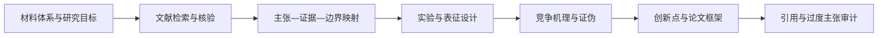

<div align="center">


# Materials Research Guide

### Evidence-grounded research planning for any materials system

基于可核验文献，为任意材料体系生成实验方案、表征矩阵、竞争机理、创新点评估与论文框架。


[功能](#核心能力) · [安装](#安装) · [使用](#使用示例) · [工作原理](#工作原理) · [开发](#本地开发与测试)

</div>

---

## 项目简介

Materials Research Guide 是一个面向材料科研人员、研究生和研发工程师的 AI Skill。

它将用户提供的材料体系与研究目标转化为可执行、可证伪、可追溯的研究设计，并强制 Agent 遵循“证据先于方案”：先检索和核验文献，再提出实验、表征、机理与创新性判断。

> GitHub 仓库名：`materials-research-guide`  
> Skill 调用标识：`evidence-grounded-materials-research`

## 为什么需要它？

通用 AI 可能生成“看起来合理”的实验条件、机理解释和参考文献，但材料研究要求每个关键判断都能追溯到可靠证据。

本项目明确禁止：

- 伪造论文、DOI、作者、期刊或实验数据；
- 将相邻材料体系的参数描述为直接证据；
- 将相关性描述为已证明的因果机理；
- 在没有系统检索时声称“首次”“唯一”或“颠覆性”；
- 给出没有来源、没有边界的精确实验条件。

无法核验的信息必须标为工作假设、工程起始值、邻近体系外推或证据缺口。

## 核心能力

| 模块 | 交付内容 |
|---|---|
| 文献证据 | 检索策略、证据表、来源等级、核验深度和证据缺口 |
| 实验设计 | 样品组、变量、对照、重复、统计方法、成功标准和停止条件 |
| 表征策略 | 科学问题—方法—可观察量—假设—局限—互证矩阵 |
| 机理分析 | 主假设、竞争假设、因果链、替代解释和证伪实验 |
| 创新点评估 | 最接近工作、真实差异、潜在价值、可行性和夸大风险 |
| 论文框架 | 中心论点、章节逻辑、结果顺序、主图规划和适用边界 |

可用于催化、能源材料、摩擦学、腐蚀、涂层、金属、陶瓷、聚合物、复合材料、界面工程等材料研究场景。

## 工作原理



### 文献核验深度

| 标记 | 含义 | 允许支持的内容 |
|---|---|---|
| `M` | Metadata：只核验书目信息和标识符 | 证明文献存在，不能支持具体参数 |
| `A` | Abstract：已核验摘要 | 支持摘要中直接陈述的有限主张 |
| `F` | Full text：已核验正文、方法或补充材料 | 支持有边界的具体条件和结果 |

来源质量、材料体系匹配度和核验深度会共同决定结论置信度。

## 安装

### 从 GitHub 安装到 Codex

```bash
git clone https://github.com/YOUR_GITHUB_USERNAME/materials-research-guide.git \
  ~/.codex/skills/evidence-grounded-materials-research
```

重新打开 Codex 任务后即可使用。请将 `YOUR_GITHUB_USERNAME` 替换为实际 GitHub 用户名。

### 其他 Agent

将整个仓库克隆或复制到对应 Agent 的 skills 目录，并确保该目录下可以直接看到 `SKILL.md`。不识别 `agents/openai.yaml` 的平台会忽略该文件，不影响核心工作流。

### 从 SkillHub 安装

Skill 通过平台审核后可执行：

```bash
skillhub install evidence-grounded-materials-research --dir ~/.codex/skills
```

## 使用示例

```text
使用 $evidence-grounded-materials-research。

材料体系：Mg-6Al 合金表面微弧氧化涂层
研究目标：提高含氯环境中的耐蚀性
现有设备：SEM/EDS、XRD、XPS、电化学工作站、轮廓仪

请先检索并核验直接文献，再生成实验方案、表征矩阵、
竞争机理、证伪实验、候选创新点和论文框架。
无法验证的内容必须标为假设或证据缺口。
```

复杂需求可以先填写 [`assets/intake-template.md`](assets/intake-template.md)。

示例输入和输出：

- [`examples/sample-input.json`](examples/sample-input.json)
- [`examples/sample-report.md`](examples/sample-report.md)

## 标准输出

每份研究报告应包含：

1. 研究问题与边界；
2. 文献证据表；
3. 证据缺口与置信度；
4. 实验方案；
5. 表征方案；
6. 机理假设与证伪；
7. 创新点评估；
8. 论文框架；
9. 安全与局限；
10. 已核验参考文献。

完整字段定义见 [`references/output-contract.md`](references/output-contract.md)。

## 本地开发与测试

项目脚本仅依赖 Python 3 标准库。

```bash
# 校验结构化输入
python scripts/validate_input.py examples/sample-input.json

# 审计示例报告的章节、证据编号和文献标识符
python scripts/audit_output.py examples/sample-report.md --min-sources 3

# 生成 SkillHub 兼容发布包
python scripts/package_skill.py .
```

审计脚本也支持标准输入：

```bash
python scripts/audit_output.py - --min-sources 3
```

打包脚本会排除缓存、构建目录和常见敏感文件，并在发布 ZIP 中注入 SkillHub 元数据。

## 仓库结构

```text
materials-research-guide/
├── SKILL.md                    # 核心触发规则与工作流
├── README.md                   # GitHub 项目首页
├── LICENSE.md                  # MIT License
├── skillhub-metadata.json      # SkillHub 发布元数据
├── agents/
│   └── openai.yaml             # Codex/OpenAI 界面元数据
├── assets/
│   ├── intake-template.md
│   ├── research-report-template.md
│   └── materials-research-guide-icon.png
├── examples/
│   ├── sample-input.json
│   └── sample-report.md
├── references/
│   ├── evidence-policy.md
│   ├── experimental-design-guardrails.md
│   └── output-contract.md
└── scripts/
    ├── validate_input.py
    ├── audit_output.py
    └── package_skill.py
```

## 安全与适用边界

- 本项目不替代实验室 EHS 审批、SDS、设备 SOP 或专业监督。
- 文献支持不等于实验必然成功，所有方案都需要预实验、对照和真实数据验证。
- 高压、高温、加压、易燃、爆炸、腐蚀、毒性和纳米粉尘风险必须遵循机构规定。
- 搜索摘要只能作为筛选线索，不能自动升级为全文级证据。
- 输出是研究设计辅助材料，不是已经完成同行评议的科学结论。

## 参与贡献

欢迎通过 Issue 或 Pull Request 改进：

- 新材料领域的实验设计护栏；
- 文献核验和引用审计；
- 更严格的机理证伪模板；
- 跨平台 Agent 元数据；
- 可复现性、安全性和科研诚信规则。

请勿提交未经授权的论文全文、内部数据、个人凭证、API Token 或虚构引用。

## License

Released under the [MIT License](LICENSE.md).

